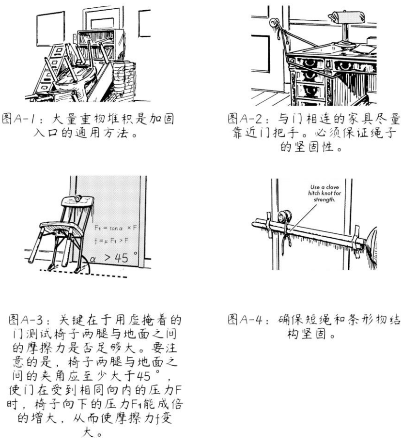
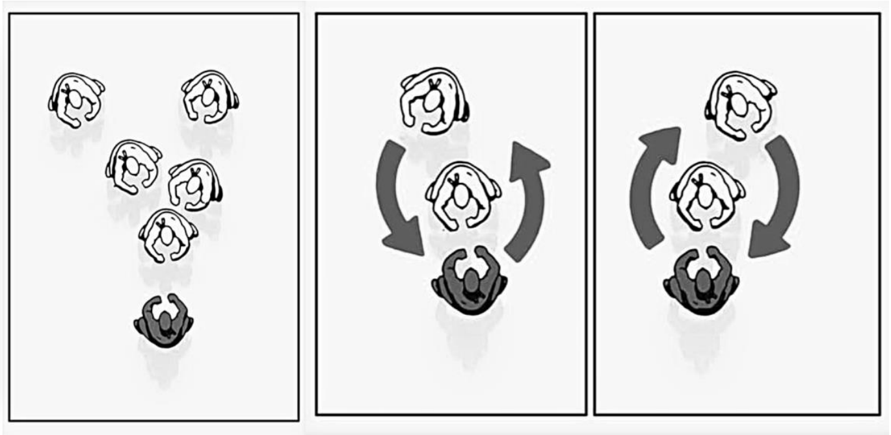
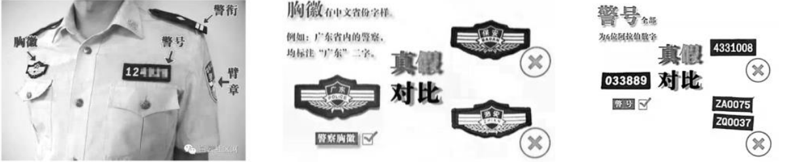
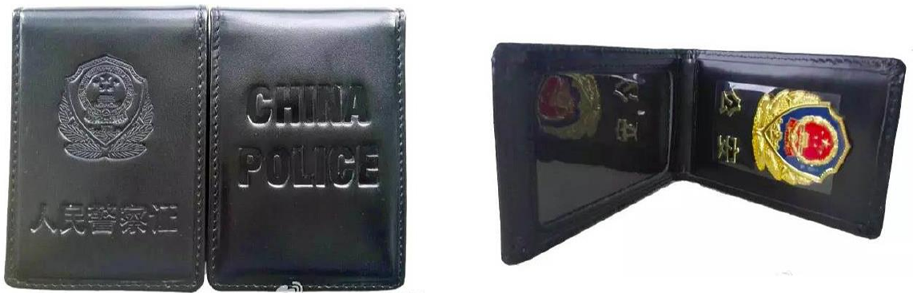

# 针对戒网瘾学校非法绑架未成年人的逃生方法解析 (Tactical Guidance for Defense Against Illegal Abductions Perpetrated by Facilities of the Troubled Teens Industry)  

## 引言  

谨以此文向十余年以来戒网瘾学校及其有关事件中遇难的受害者致以最沉痛的悼念。  
本文针对处于可能被相关机构绑架的威胁中的未成年人，并参照了数十部有关防身、格斗、逃生、反追踪等相关主题的文献资料及书籍等，其中包括国际认可的专家 Rory Miller, Tim Larkin, Peter Consterdine, Patrick Van Horne 等人的书目。文中的一切措施以保护未成年人人身安全、为其提供逃生机会为唯一目的。  
以下所有内容针对人身安全受到严重威胁，体能等方面处于劣势的未成年人。主要目的是为其提供一套短时间内，在条件有限的情况下，使逃生可能性最大化的方案。  
紧急情况下请跳至第一节以及第二节第四部分阅读。
本文仅供学术研究使用，具体操作请在专业人士的指导下进行，并确保合法性。（如出现利用本文中理论及方法实施违法犯罪的行为，参与本文编写的成员一律不承担任何形式的法律责任。）  

## 重要参考书目及文件（按首字母排序）

> Advanced Krav Maga - David Kahn  
> Advanced Situational Awareness - Department of the Army  
> Combat Concepts - Peter Consterdine  
> Combat Use of the Double-Edged Fighting Knife - Col. Rex Applegate  
> Dead or Alive the Choice Is Yours - Geoff Thompson  
> Deadly Force Encounters - Loren Christensen  
> Facing Violence: Preparing for the Unexpected - Sgt. Rory Miller  
> Fight Like a Physicist - Jason Thalken  
> Fighter's Fact Book 2 - Loren Christensen  
> How to Survive the Most Critical 5 Seconds of Your Life - Tim Larkin, Chris Ranck-Buhr  
> Krav Maga Combatives: Maximum Effect - David Kahn, Sean Hoggs  
> Krav Maga Professional Tactics - David Kahn  
> Left of Bang: How the Marine Corps' Combat Hunter Program Can Save Your Life - Jason A. Riley, Patrick Van Horne  
> Meditations on Violence: A Comparison of Martial Arts Training With Real World Violence - Sgt. Rory Miller  
> Pool Cues, Beer Bottles, and Baseball Bats - Marc MacYoung  
> Principles of Personal Defense - Jeff Cooper  
> Put 'Em Down, Take 'Em Out: Knife Fighting Techniques From Folsom Prison - Don Pentecost  
> Real Head, Knees, and Elbows - Geoff Thompson  
> Real Kicking - Geoff Thompson  
> Real Punching - Geoff Thompson  
> Scaling Force: Dynamic Decision Making Under Threat of Violence - Sgt. Rory Miller, Lawrence A. Kane  
> Spotting Danger Before It Spots You: Build Situational Awareness to Stay Safe - Gary Quesenberry  
> Spy Secrets That Can Save Your Life - Jason Hanson
> Street E & E - Marc MacYoung  
> Streetwise - Peter Consterdine  
> Survive Like a Spy - Jason Hanson  
> Survive the Unthinkable - Tim Larkin  
> The Big Bloody Book of Violence - Lawrence A. Kane, Kris Wilder
> The Gift of Violence - Matt Thornton  
> The Little Black Book of Violence - Lawrence A. Kane, Kris Wilder, Lt. Col. John R. Finch, Marc MacYoung, Sgt. Rory Miller  
> The Modern Bodyguard: The Complete Manual of Close Protection Training - Peter Consterdine  
> The Pavement Arena - Geoff Thompson  
> Three Second Fighter - Geoff Thompson  
> US ARMY FM 21-150 (Hand to Hand Combat) - Department of the Army  
> Violence of Mind - Varg Freeborn  
> When Violence Is the Answer - Tim Larkin  

## 正文

### 第一节: 事发前

内容概要：本章节中主要针对事发前应做的有关准备进行指导，目的在于为后续的防卫和逃生提供条件。  
在事发之前所能做的准备可分为两个方面：反应准备和攻势预备。  

#### **一: 反应准备**

第一个方面，即反应准备，是本章节中最为核心的部分。反应准备包括日常生活中为应对威胁所做的所有准备。  
这一方面中的内容目的在于使可利用的反应时间最大化。根据大量亲历者的描述，相关机构的人员实施绑架通常选定在深夜或凌晨，在受害者警戒最松懈的时候实施犯罪（具体过程各有差异，网络上有较多的受害者经历记录，此处不作赘述）。  
以上行为的共性是绑架成功实施的主要原因之一，即突发性。从受害者探知威胁到对情况作出评估、判断，再到寻找对策，考虑是否对其做出反应的过程需要大量的时间，远超过犯罪行为人控制受害者所需的数秒钟（详见第二节有关 OODA 循环理论的内容）。  
此处的目标就是通过事先准备为自身提供充足的反应时间，解除侵害人的上述优势。  

**对房间入口的加固和简易警铃的安装**  

第一点措施，是对夜间身处房间或住所入口的加固和简易警铃的安装。对入口结构的改进包括对于门和低层住户中窗户的临时加固。  
其中对门进行加固时，可将门分为向外打开和向内打开的两类。考虑到侵害人破门的可能性，向外打开的门需应对向外、向内两种方向的攻破，即同时采取两种措施。  
应对向内攻入的威胁有以下几种方法：  

  

1. 可用大量家具或重物（如椅子、橱柜、沙发等）堆积在门内侧，较重的物体集中在门把手处，如图 A-1 所示。  
2. 用结实短绳将房间中紧靠门把手的家具（重量较大）和门把手捆绑在一起（原理与旅馆防盗门链相同），如图 A-2 所示。  
3. 在房间内部，将椅背高于门把手的椅子向后倾斜，并将椅背顶部紧抵在门把手下方，靠近椅背的两脚紧触地面（使用前需事先用未关紧的门测试此方法，确保地面摩擦力够大），如图A-3 所示。

应对侵害人将门向外拉的情况，可以采取应对向内攻入的第 1、2 种方法（方法 1 中的障碍物堆积可延长侵害人闯入所需的时间）。此外，还可以用结构坚固的扫帚、拖把等条形物横架在左右门框之间。其高度与门把手相近，且两端用胶带固定在房间内的墙面上。用短绳将门把手与条形物捆绑在一起并拉紧，如图 A-4 所示。对窗户的加固可参考上述措施进行修改，应用原理相似。  
第二步是设置简易警铃，从而在事发的第一时间作出反应。临时警铃的主要功能是在门把手（此处为条形把手）转动时被触发，发出较大的声音。  
通常而言，简易警铃可通过以下方式安装：将坚硬重物用绳索悬挂在条形门把手中间，从而使悬挂重物的绳索在门把手被下压时滑落，让重物撞击地面（地面铺有地毯或软垫时，应提前在重物落点上放置与重物相撞可发出足够声响的物体）。  
除此之外，安装的过程中还需考虑延时的因素，即从门把手转动到重物撞击地面的时间间隔。延时可通过改变重物悬挂的高度来调整，且一般不得超过 0.3 秒。  

**白天对突发情况的应对准备**

第二点措施， 是在白天的生活作息中对突发情况的应对准备。尽管大多数绑架都在夜晚发生，但不排除有在白天实施犯罪的案例。因此以下措施针对的是除睡眠时间外全天的生活作息。  
这类准备包括以下三点：室内工作位置的选择、逃生的准备和对环境的感知与警戒。  

1. 室内工作位置的选择：在一定的室内空间中，有两个衡量人身处位置优劣势的指标，即人与各入口的距离和人与潜在临时武器（下文中详述）的距离。  
在一般情况下，所处的位置应背对墙面或墙角，面向与外界相通的入口。如果有多个入口，应尽量使各入口均处于视野范围内。  
在满足上述条件的前提下，使人与各个可能出现威胁的入口之间的距离最大化（提供足够的反应时间），与各潜在临时武器之间的距离最小化（缩短自身所需反应时间）。在选定位置周围不可有过多的障碍物堆积，尽量腾出一片空地，以免在紧急情况下影响行动。  
2. 逃生的准备：在有条件的情况下，应在身边放置一小包打包好的必需品。其中包括通讯设备、不显眼的衣物（逃生时用于降低辨识度）、现金、可供防身的临时武器等。  
3. 逃生的准备：在有条件的情况下，应在身边放置一小包打包好的必需品。其中包括通讯设备、不显眼的衣物（逃生时用于降低辨识度）、现金、可供防身的临时武器等。  

进入不熟悉的室内空间时，需了解建筑物中可用于逃生的出口并提前熟悉，以及注意身边潜在的临时武器等，对环境保持充分的认知。关于这一点，在第三点措施中会进行详细的说明。  

**出行安全与周围环境分析**  

第三点措施有关出行安全与对陌生环境的分析。这一项措施旨在防范可能发生在室外的绑架事件。在早期发生的案例中，有相当一部分受害者在公共场所遭到绑架，因此本文中对此进行详细的说明。  
在公共场所发生的绑架事件与住宅内相比，对于突发性和意外性的依赖更为显著，并且通常只在人群较少的情况下发生。因此，一般认为有效的防范措施能够避免受害者在公共场所遭到绑架。以下内容针对外出时的安全问题进行指导。  

1. 出行安全  
    - 避免固定日程规律：  
        固定日程，如上学、上班等，即经常在固定的时间，通过同样的路线前往固定地点。这类行程信息容易被侵害者利用，导致受害者在途中遭到绑架。为尽可能减小遭到跟踪或突袭的可能，去往同一目的地时，需尽量多选择不同的路线。除此之外，每次出行时还可以尽量从不同地点位置（或在不同时间）出发，以不同的速度，通过不同的交通工具前往。这些措施将会极大地减小侵害人利用受害人的日程规律，对其实施绑架的可能性。  
    - 避免信息泄露:  
        关闭电子设备的定位功能，尤其是社交媒体、相机等应用中的定位功能（或权限）。  
    - 辨认是否存在跟踪者  
        由于相关机构用于实施绑架的成本较小，不可能对于同一目标进行系统的跟踪。通常先确定受害者会经过较为偏僻的地点，再进行一次性的尾随和绑架。在以上条件下，辨认跟踪者的方式较为简单。但应注意通常实施跟踪、绑架的人数一般在 2 人及以上，且通常一同行动。  
        在外出时尽量携带一面小镜子用于观察后方，也可使用手机屏幕观察。相应地，沿路可注意道路旁的反光平面，如玻璃门、积水坑、抛光的金属平面等，从中观察后方是否存在跟踪者。身处任何地方都应注意观察身旁人群，如在不同地点连续三次看见相同的人，则可基本确定自身受到跟踪。辨认身旁是否是同一个人，除了根据样貌之外，还可看鞋子进行判断（由于在跟踪过程中，其他衣物相对容易被替换，而鞋子不容易）。  
        在怀疑自己受到跟踪，且有明确的怀疑对象时，尽量保持自身待在人群较多且光照充足的公共场所内，并在第一时间报警。  
        如不确定是否受到跟踪，或不确定受到谁的跟踪，首先需保证自身不进入任何偏僻无人的地方。在此基础上，有以下几种方法可做出判断：（1）可搭乘公交、地铁等公共交通并在随机站点下车，并观察一同上下车的人。跟踪者将会在一同上车且一同下车的人当中。如这类人较多，可进行换乘并重复上述步骤。（2）可进入室内空间比较复杂的建筑物（如大超市、商场等，必须有两个以上的出口，否则此方法无效），并在室内通过一条复杂的路径走到另一个出口。如发现进入建筑物前后（以及在途中）均观察到了相同的人，则可确定受到跟踪。（3）在不同的街道上进行多次转弯（包括掉头），确保自身走过的路径足够复杂。如在途中多次观察到相同的人，则可确定受到跟踪。需注意的是必须离开跟踪者的视线，才能迫使跟踪者跟随转弯。如离开嫌疑人的视线后，嫌疑人处于原位不动，则表明其未参与跟踪。  
        以上方法可混合使用，以取得最大成效。  
    - 其他注意事项  
        在日常外出时尽量结伴出行，避免进入偏僻无人的地方，并且时刻对周围环境保持警惕。步行时切勿背对马路，而且需格外注意身旁停下的车辆，以防绑架者驾车跟踪并突然下车实施绑架。如发现可疑人员接近，立刻向人群密集的方向逃离。并寻求警方帮助。  
2. 周围环境分析  
    - 根据行为基准发现异常：  
        行为基准，即一个地点或人群里在某一时间的行为常态（他们行为的共同点）。如不符合行为基准，则会表现得与人群格格不入。认识一个地方的行为基准后，应重点注意不符合此基准的人（如：情绪与环境气氛不相符，穿着特殊且与人群形成反差、身份与出现的地点不符等）。在这部分人当中，具有危险因素的人会表现出警惕性较高、对周边环境的关注强烈（经常四处观察）、对自身（受害者）表现出异常关注等特征。  
    - 对周围环境的观察  
        应时刻保持对周边环境和人群的观察。在过程中需避免对某些人或事物过度警惕专注，并保证对整体环境有充分的感知。观察中不仅应关注周围人的行为（是否表现出过度警惕，是否对周围环境或自身表现出过度关注等），还应注意周边可用于实施防卫的临时武器。在室内时应时刻关注（并牢记）建筑物的出口位置、数量以及与自身的距离。在外出时应将注意力放在周边环境上，避免使用手机、耳机等容易吸引注意力的产品，切勿在途中阅读长文本，与他人进行过于投入的交谈等。一切可能导致对周围环境的关注度降低的事情，都必须在已知安全的地方进行。  
    - 关注自身直觉  
        关注自身对于周围环境产生的直觉，如紧张、恐惧等。在部分情况下，可能无法有意识地感知到这类直觉，但它们会通过生理反应（如肾上腺素分泌、心跳加速等）体现。上述直觉的形成过程是下意识的，而不是经过有意识的理性思考产生的。这是人类生存过程中，用于避开危险的进化优势之一，应对其有充分的关注和重视。在直觉感受到周围环境或情况危险、可疑时，最佳选择是尽快远离当前地点，前往已知安全的地方。  
        关注直觉并依靠其规避危险，需要避免出现正常化偏误。正常化偏误，即在危险来临的时候将其视为正常情况。这类认知误差容易导致人忽略直觉信号（及其相应生理反应），造成无法及时作出反应的后果。需要注意直觉是不经过有意识的理性思考的，在试图规避风险的时候，不应通过理性分析来质疑直觉，否则容易出现正常化偏误。  

#### **二: 攻势预备**

第二个方面，即攻势预备，将直接与第二节中的具体防身措施接轨，并为其奠定基础，提供一定的条件。  
此方面主要包括临时武器的分类、选择、携带和放置等内容。第二节中的防身和格斗指导内容中除致人重伤或死亡的徒手攻击之外，将偏重于临时武器的有效运用。因此以下内容会作为后文中实际应用方面的重要基础。  

**临时武器的分类与示例**  

在本文中，临时武器指一切可用于对人体结构造成一定损伤的生活常用用品。按照用途和所针对的人体结构及部位，可分为五大类：高温液体、重物类、锐器类、棍棒类、粉末类。临时武器的关键性优势在于其普遍性，因为它们绝大多数是生活中常见的用品，在有限的条件下容易直接获取并应用。  
其中高温液体包括开水、热咖啡等温度达到水沸点的液体（建议盛放在容易开启的保温杯中，随身携带，每隔 2~3 小时换一次水）；  
重物类包括平底锅、铁锅、重量较大的花盆或其它摆件、热水瓶、金属水杯、羊角锤、石块或砖块等；  
锐器类包括老式剪刀或厨用剪刀、水果刀（菜刀不建议使用，原因在第二节详述）、螺丝刀（确保结构坚固，手柄长度约等于手掌宽度），破啤酒瓶（底部为尖锐端）等；  
棍棒类包括棒球棍、钢管、旧凳脚、铁铲、吉他等（本质上是有一定长度的重物类）；  
粉末类包括生石灰（溶于水放出大量的热）、干粉式灭火器（注意使用前打开保险）、辣椒粉、食盐等。  

**临时武器的选择标准**  

对于临时武器的选择，本文在此给出一定标准。使用不符合以下标准的物件可能无效，甚至导致使用者受伤。  
重物类、锐器类、棍棒类必须保证结构坚固，可操控性强，使用时手掌或手指与其接触的部分受力均匀。  
在此基础上，重物类需保证质量足够大（因人而异），可用于打击的一端硬度大；锐器类应有一端较尖锐，适用于 5cm 及以上深度的穿刺（不需要有刀刃，但末端必须尖锐），同时握柄体积不可过小；  
棍棒类确保打击端硬度、质量足够大。针对本文应对的特定情况，建议优先选择高温液体和锐器类物件。  

**临时武器的携带、放置及取用**  

由于所要面对情况的突发性，在选择之后，携带和放置将是决定是否有机会使用临时武器的关键性因素。在一般情况下，便携性临时武器的携带应遵循以下两个原则：1. 尽可能在处于不同的姿势时都能顺利、便捷、快速地取出。2. 尽可能让取出所需的时间最小化。  
通常情况下取用所需的时间必须小于 0.5 秒，同时无论是随身携带或是放置在室内的不同地方，在事发前都应尽量多练习将其取出的动作，形成一定程度的肌肉记忆，以确保在高度紧张的状态下能够顺利取用。  
在此基础上，身处室内时应选择在多个不同的地方放置备用临时武器（如各卧室的床头柜中、客厅
茶几下等），且放置位置的分布应尽量均匀，并遵循使取用所需时间最小化的原则。以确保在不同位置
（如卫生间、储藏室等）都能顺利应对突发的紧急情况。
同时可了解部分不便携带的重物类器具（如热水瓶、平底锅等）在室内的位置。为以防万一，即使
是在室内也应当尽量确保身边常备几件能起到较大效用的临时武器。
此外，因特殊原因无法在夜间采取阻门措施时，应在床头或枕下放置锐器类或棍棒类器械，在条件
允许时尽量使用刀具或其他锐器。
身处室外或公共场所时应保证根据以上标准随身携带临时武器，以防在街头出现紧急情况（往年有
部分案例的事发地点在街头或室外）。在不同环境中应有意识地辨认出周边可用的临时武器（如工地边的
钢管、砖块，超市里的刀具等），事先做好充分的准备，根据环境特点，形成处理潜在威胁的大致计划，
以免在紧急情况下临时做出错误的决策。  

### 第二节: 事发时

内容概要：本章节中主要针对非法侵害进行前后所采取的防卫措施进行指导，为逃生创造必要条件。  
鉴于近十余年戒网瘾学校受害者在遭受绑架时直接逃脱成功率极低的现象，本文中将采取非常规措施，目的在于进行防卫、确保使犯罪行为人失去继续侵害的能力后再行逃生。在大多数情况下，这也是逃生唯一可能的方式。  
以下的内容为全文的核心部分，最终目的是在其体能、人数等各方面处于劣势的情况下确保未成年人逃生的概率最大化。  

#### **一：站位选择与初步应对**  

**站位选择与相对位置控制**  

本文针对的绝大多数绑架行为由 2~5 人集体实施，因此在事发的第一时间，在有足够反应时间的条件下，最紧迫的问题是处理好与各罪犯之间的相对位置，避免受到围攻。针对此目的的措施如下  

  

1. 调整自身所处位置，尽量使敌方各人都处于自身的正前方，且处于前面的人与处于后面的人形成遮挡关系。此时直接处于自身正前方的人会将余下大多数人与自身隔离开，如图 B-1 所示。  
2. 在采取防卫措施的过程中不断移动脚步，增加变数，使敌方较难控制形势。在条件允许的情况下保持上述相对位置，避免遭受压制和围攻，如图 B-2。  

**初步应对阶段**

在位置调整完成之后，将进入初步应对阶段。在部分案例中，绑架时相关犯罪行为人会假冒国家公职人员宣称“拘捕”受害人，或声称将其带走“接受调查”，要求受害人配合。  
如果侵害人尚未放松戒备或自身仍处于不利于攻击的位置，那么此时的唯一原则就是在表面上顺从，表现出对其不构成威胁的特征，同时做好进攻的准备。  
在应对的过程中，保持距离是另一决定性因素。根据美国盐湖城警官 Dennis Tueller 的实验研究(Tueller Drill Study)，（生理上正常的）袭击者通常可在 1.5 秒内穿过 21 英尺的路程（即 21 英尺法则）。由以上数据推算可知，当距离小于 2.1~2.2 米左右时，由于人体的生理限制，已较难作出及时的反应。  
因此初步应对时，在不引起对方警觉的范围内，需尽量与侵害人保持一定距离。同时尽量让自身双手远离侵害人的双手。这些安全措施旨在防备偶然的意外攻击，延长反应时间。一旦确定其绑架意图和对人身安全即时性威胁的存在，则必须采取断然措施。  

#### **二：情况及策略分析**  

如果对街头格斗中常用的防身手段毫无概念，可先阅读第二节的四、五部分再回到此处继续阅读。  
鉴于此类绑架行为的特殊性，本文在此根据具体情况的特性对双方优劣势作出分析，此处的形势分析将帮助防卫人初步了解所面临的情况特征。  

**双方优劣势分析**  

近十余年来，本文所针对的绑架行为从理论上讲对以下两点优势有较强的依赖性：1. 人数优势。2.体能优势（有待质疑，但本文中假设其存在）。除第一节中所述的突发性和假冒国家公职人员的欺骗性之外，上述两点优势所构成的威慑在作案过程中发挥了主要作用。  
而反观受害者方面，以下几点为最主要、有利用价值的优势:   
1. 防卫行为的突发性和意外性。  
    上文中初步应对的措施以及罪犯认为其处于绝对优势的错误判断，使自身的防卫行为具备了意外性，增大了初次攻击的成功率。
    由于人体反应速度的生理限制，在正常情况下（双方面对面，距离约 60~80cm）防卫人所进行的第一次打击通常无法被侵害人躲避或格挡，因而能对其造成严重创伤并有效解除威胁。
2. 目的差距。  
    在本情况下犯罪行为人的主要目的是控制受害者并将其带入运输车辆中，而防卫人的唯一目的是打击罪犯继续实施侵害的能力，以增大逃生概率。  
    此时犯罪行为人的主要手段是控制性的，即以制约受害人的行动为目的，而受害者应该采用的手段是攻击性的，即不择一切手段和方式解除威胁。  
    从街头格斗和应对反社会暴力（在这种情况下唯一解除威胁的方式是使侵害人失能，从这个方面来看可近似认为是反社会暴力）的角度来看，和控制性行为相比，以造成损伤为目的的进攻极其容易使对方失去继续产生威胁的能力，即失能（incapacitated），有本质上的明显优势（下文详述）。
3. 威慑性。  
    受害人采取极端方式反抗的行为本身对于侵害人而言有一定的威慑力。而通常实施绑架的罪犯在其组织中属于被剥削者（非正式工，通常薪资在 2000~3000 元/月），在第一、二个人受伤，充分表现出情况的危险性后，剩余的人冒着严重安全风险继续实施侵害的可能性较小。  
    在消除对方人数优势这一方面，在一定程度上需要依靠对其安全造成严重威胁的手段，使侵害人失去继续实施绑架的意愿。应当注意的是，防卫过程中不但要切实地对侵害人产生威胁，而且需要让其余的侵害人明显直观地看到继续实施犯罪的后果，有意识地进行威慑，凸显事态的严重性。
4. 主动性。  
    由于绑架过程中的控制行为通常不会对受害者造成较大的损伤，在自身采取防卫措施过程中的第一次攻击才是事发时造成的初次伤害。
    换言之，受害者在绝大多数情况下有先发制人，首先给对方造成严重创伤的机会，而把握这种机会是防卫成功的必要条件之一。造成初次伤害可使情况超出犯罪行为人的预料范围，从而导致其失去对局面的控制，使受害者占据主动地位，为完全解除威胁奠定良好的基础。  
5. 事先准备。  
    相较于侵害人而言，受害者有充足的时间做防卫准备，预备临时武器，制定具体的防卫计划，在冲突发生时有机会占取较大的优势。
6. 肾上腺素的分泌。  
    肾上腺素可在短时间内扩张通往肌肉的血管，在一定程度上增强力量和速度，缩短反应时间，降低对疼痛的感知能力，从而减小与侵害人体能上的差距。  
    但肾上腺素分泌过多可能导致反应速度降低、出现隧道视觉、大脑供血量减小等对防卫和逃生极为不利的因素产生。  

**犯罪行为人的身份辨别**  

注：关于犯罪行为人假冒民警宣称“拘捕”受害人的情形应对：被可疑人员以接受警方调查或其他借口试图带离时，应第一时间辨认其身份，若认定为犯罪行为人，一旦感到被强行带离的威胁存在，应立即实施防卫。  
辨认民警身份的方式如下：  

1. 观察警服配备。  
    警服必须有警衔、警号、胸徽、臂章 4 种警用标志。缺失任何一样都可认定其为假冒民警。  
    胸徽印有省份名称，警号为 6 位阿拉伯数字。（如图 B-3）  
      
2. 要求其出示证件  
    拒不出示的认定为假冒。人民警察证皮夹为竖式黑色皮质，外部正面压印警徽图案和“人民警察证”字样，背面压印“China Police”，整体立体突出，颜色鲜亮。向上翻开皮夹，内部上端镶嵌金属警徽一枚和“公安”二字，下端放置内卡。以上任何一个细节无法对应，都可确定为假冒证件。（如图 B-4）  
      

#### **三：战术及策略的核心原则和基本理念**  

由于此处将要阐述的理论内容较为抽象，如果对街头格斗中常见的具体攻击手段不熟悉，建议阅读第二节第四、五部分后再回到此处阅读。  
以下的内容是本章节中防卫体系的基石和防卫成功的必要条件。  
本小节分为三部分：1. 防卫过程的特性概述。2. 防卫过程的总方针。3. 对防卫人观念模式的要求。  

**防卫过程的特性概述**

在阐述具体理念与原则之前，此处先对防卫过程的特性作一概述，这一概述将作为此部分内容的基础。  

1. 防卫的最终目的在于使侵害人失去继续实施侵害的能力（此状态将其定义为失能，或incapacitated），即对其重要的生理结构造成无法自然恢复的损伤。  
2. 应采取一切可能的措施和手段确保上述目的实现。我国刑法第 20 条第 3 款规定：“对正在进行行凶、杀人、抢劫、强奸、绑架以及其他严重危及人身安全的暴力犯罪，采取防卫行为，造成不法侵害人伤亡的，不属于防卫过当，不负刑事责任。”  
    以此为基础，针对侵害人采取的防卫措施无任何限制，应不择手段，采用一切可行的方式，以使对方失去侵害能力为唯一目的，在最短的时间内使伤害最大化，最大限度地扩大自身逃生的可能性。以上也是本章节的基本理念和目标导向。
3. 防卫过程极其混乱，与大多数街头格斗相似。根据大量街头格斗亲历者的描述可得知，有多名侵害者参与、存在器械运用的自卫情况会使局面极度混乱。对此应当有充分的心理准备。
4. 结果具有偶然性。考虑到牵连的总人数较多，且人体反应能力受限，防卫的全过程将极其混乱、不可预知。  
    在上述情况下，防卫的成功与否仍存在较大偶然性。下文中防卫措施实施的原则之一就是尽可能减小偶然性，运用成功率高、可靠、简单的策略和战术。绝对不可使用理论上可行的措施和网络盛行的无法对侵害人造成任何伤害的 “招式”。
5. 技巧的无关性。此性质适用于大多数需采取防卫措施的紧急情况。它的主要意义在于，在攻击目标、防卫策略和打击面（即自身用于对侵害人造成创伤的生理结构或器械，或 striking surface）得当的前提下，防身技巧对防卫是否成功无关，或其关系可忽略不计。  
    技巧的无关性也同样适用于侵害人，即其所受的训练在无限制的条件下不会使其受到严重伤害的概率减小。  
    在一定距离内（约 60cm），由于人体反应速度的生理限制，不可能对他人的袭击进行及时格挡或躲避（因此受害者初次打击通常能对侵害人造成创伤）。人体易受创伤的根本原因就在于反应速度上的生理限制、要害易受损、以及其受损后会严重影响生理活动的特性，而不在于防身或格斗技巧的缺失。  
    这意味着即使是受过训练的侵害人，在无限制的条件下，受到严重伤害的概率也不比常人小，同样无法有效抵御突发性的袭击和临时武器（如开水）的攻击。  
    总而言之，在无限制的条件下，技巧性措施的运用效用不大，既无法适应极度紧张混乱的局面，又无法有效削弱和平衡侵害人体能上的优势。不符合本文的目的和要求。  
6. 在对方人数较多时，必须充分利用极端防卫措施的威慑力，有意识地让剩余的人直观感受到继续侵害可能带来的后果，在心理上产生强烈的震慑效果，促使对方中止犯罪。这是目前单独应对多个侵害人唯一较为可靠的方案。  
7. 大多数情形下，解除一名侵害人的威胁所需时间约在 2~3 秒之间。从确定目标到对其要害进行有效打击，从而解除威胁，防卫过程进行的总时长非常短（对体能要求较低）。如果无法在短时间内解除威胁，与侵害人进行缠斗，则极有可能受其围攻、控制。  

**防卫过程的总方针**

