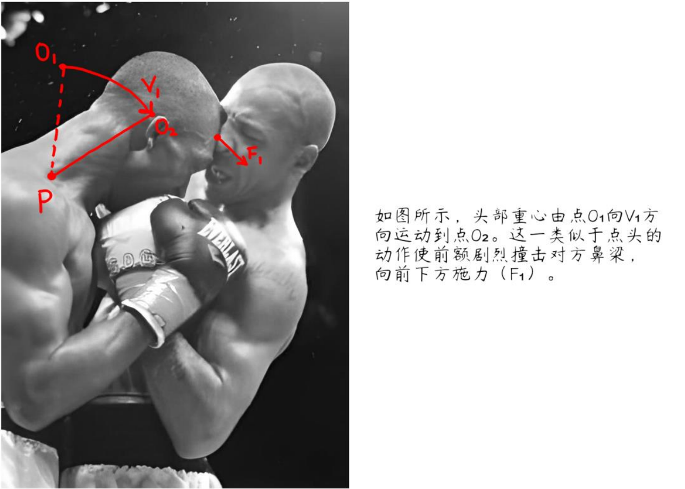

# 针对戒网瘾学校非法绑架未成年人的逃生方法解析   (Tactical Guidance for Defense Against Illegal Abductions Perpetrated by Facilities of the Troubled Teens Industry)  

## 引言  

谨以此文向十余年以来戒网瘾学校及其有关事件中遇难的受害者致以最沉痛的悼念。  
本文针对处于可能被相关机构绑架的威胁中的未成年人，并参照了数十部有关防身、格斗、逃生、反追踪等相关主题的文献资料及书籍等，其中包括国际认可的专家 Rory Miller, Tim Larkin, Peter Consterdine, Patrick Van Horne 等人的书目。文中的一切措施以保护未成年人人身安全、为其提供逃生机会为唯一目的。  
以下所有内容针对人身安全受到严重威胁，体能等方面处于劣势的未成年人。主要目的是为其提供一套短时间内，在条件有限的情况下，使逃生可能性最大化的方案。  
紧急情况下请跳至第一节以及第二节第四部分阅读。
本文仅供学术研究使用，具体操作请在专业人士的指导下进行，并确保合法性。（如出现利用本文中理论及方法实施违法犯罪的行为，参与本文编写的成员一律不承担任何形式的法律责任。）  

## 重要参考书目及文件（按首字母排序）

> Advanced Krav Maga - David Kahn  
> Advanced Situational Awareness - Department of the Army  
> Combat Concepts - Peter Consterdine  
> Combat Use of the Double-Edged Fighting Knife - Col. Rex Applegate  
> Dead or Alive the Choice Is Yours - Geoff Thompson  
> Deadly Force Encounters - Loren Christensen  
> Facing Violence: Preparing for the Unexpected - Sgt. Rory Miller  
> Fight Like a Physicist - Jason Thalken  
> Fighter's Fact Book 2 - Loren Christensen  
> How to Survive the Most Critical 5 Seconds of Your Life - Tim Larkin, Chris Ranck-Buhr  
> Krav Maga Combatives: Maximum Effect - David Kahn, Sean Hoggs  
> Krav Maga Professional Tactics - David Kahn  
> Left of Bang: How the Marine Corps' Combat Hunter Program Can Save Your Life - Jason A. Riley, Patrick Van Horne  
> Meditations on Violence: A Comparison of Martial Arts Training With Real World Violence - Sgt. Rory Miller  
> Pool Cues, Beer Bottles, and Baseball Bats - Marc MacYoung  
> Principles of Personal Defense - Jeff Cooper  
> Put 'Em Down, Take 'Em Out: Knife Fighting Techniques From Folsom Prison - Don Pentecost  
> Real Head, Knees, and Elbows - Geoff Thompson  
> Real Kicking - Geoff Thompson  
> Real Punching - Geoff Thompson  
> Scaling Force: Dynamic Decision Making Under Threat of Violence - Sgt. Rory Miller, Lawrence A. Kane  
> Spotting Danger Before It Spots You: Build Situational Awareness to Stay Safe - Gary Quesenberry  
> Spy Secrets That Can Save Your Life - Jason Hanson
> Street E & E - Marc MacYoung  
> Streetwise - Peter Consterdine  
> Survive Like a Spy - Jason Hanson  
> Survive the Unthinkable - Tim Larkin  
> The Big Bloody Book of Violence - Lawrence A. Kane, Kris Wilder
> The Gift of Violence - Matt Thornton  
> The Little Black Book of Violence - Lawrence A. Kane, Kris Wilder, Lt. Col. John R. Finch, Marc MacYoung, Sgt. Rory Miller  
> The Modern Bodyguard: The Complete Manual of Close Protection Training - Peter Consterdine  
> The Pavement Arena - Geoff Thompson  
> Three Second Fighter - Geoff Thompson  
> US ARMY FM 21-150 (Hand to Hand Combat) - Department of the Army  
> Violence of Mind - Varg Freeborn  
> When Violence Is the Answer - Tim Larkin  

## 正文

### 第一节: 事发前

内容概要：本章节中主要针对事发前应做的有关准备进行指导，目的在于为后续的防卫和逃生提供条件。  
在事发之前所能做的准备可分为两个方面：反应准备和攻势预备。  

#### **一: 反应准备**

第一个方面，即反应准备，是本章节中最为核心的部分。反应准备包括日常生活中为应对威胁所做的所有准备。  
这一方面中的内容目的在于使可利用的反应时间最大化。根据大量亲历者的描述，相关机构的人员实施绑架通常选定在深夜或凌晨，在受害者警戒最松懈的时候实施犯罪（具体过程各有差异，网络上有较多的受害者经历记录，此处不作赘述）。  
以上行为的共性是绑架成功实施的主要原因之一，即突发性。从受害者探知威胁到对情况作出评估、判断，再到寻找对策，考虑是否对其做出反应的过程需要大量的时间，远超过犯罪行为人控制受害者所需的数秒钟（详见第二节有关 OODA 循环理论的内容）。  
此处的目标就是通过事先准备为自身提供充足的反应时间，解除侵害人的上述优势。  

**对房间入口的加固和简易警铃的安装**  

第一点措施，是对夜间身处房间或住所入口的加固和简易警铃的安装。对入口结构的改进包括对于门和低层住户中窗户的临时加固。  
其中对门进行加固时，可将门分为向外打开和向内打开的两类。考虑到侵害人破门的可能性，向外打开的门需应对向外、向内两种方向的攻破，即同时采取两种措施。  
应对向内攻入的威胁有以下几种方法：  

  

1. 可用大量家具或重物（如椅子、橱柜、沙发等）堆积在门内侧，较重的物体集中在门把手处，如图 A-1 所示。  
2. 用结实短绳将房间中紧靠门把手的家具（重量较大）和门把手捆绑在一起（原理与旅馆防盗门链相同），如图 A-2 所示。  
3. 在房间内部，将椅背高于门把手的椅子向后倾斜，并将椅背顶部紧抵在门把手下方，靠近椅背的两脚紧触地面（使用前需事先用未关紧的门测试此方法，确保地面摩擦力够大），如图A-3 所示。

应对侵害人将门向外拉的情况，可以采取应对向内攻入的第 1、2 种方法（方法 1 中的障碍物堆积可延长侵害人闯入所需的时间）。此外，还可以用结构坚固的扫帚、拖把等条形物横架在左右门框之间。其高度与门把手相近，且两端用胶带固定在房间内的墙面上。用短绳将门把手与条形物捆绑在一起并拉紧，如图 A-4 所示。对窗户的加固可参考上述措施进行修改，应用原理相似。  
第二步是设置简易警铃，从而在事发的第一时间作出反应。临时警铃的主要功能是在门把手（此处为条形把手）转动时被触发，发出较大的声音。  
通常而言，简易警铃可通过以下方式安装：将坚硬重物用绳索悬挂在条形门把手中间，从而使悬挂重物的绳索在门把手被下压时滑落，让重物撞击地面（地面铺有地毯或软垫时，应提前在重物落点上放置与重物相撞可发出足够声响的物体）。  
除此之外，安装的过程中还需考虑延时的因素，即从门把手转动到重物撞击地面的时间间隔。延时可通过改变重物悬挂的高度来调整，且一般不得超过 0.3 秒。  

**白天对突发情况的应对准备**

第二点措施， 是在白天的生活作息中对突发情况的应对准备。尽管大多数绑架都在夜晚发生，但不排除有在白天实施犯罪的案例。因此以下措施针对的是除睡眠时间外全天的生活作息。  
这类准备包括以下三点：室内工作位置的选择、逃生的准备和对环境的感知与警戒。  

1. 室内工作位置的选择：在一定的室内空间中，有两个衡量人身处位置优劣势的指标，即人与各入口的距离和人与潜在临时武器（下文中详述）的距离。  
在一般情况下，所处的位置应背对墙面或墙角，面向与外界相通的入口。如果有多个入口，应尽量使各入口均处于视野范围内。  
在满足上述条件的前提下，使人与各个可能出现威胁的入口之间的距离最大化（提供足够的反应时间），与各潜在临时武器之间的距离最小化（缩短自身所需反应时间）。在选定位置周围不可有过多的障碍物堆积，尽量腾出一片空地，以免在紧急情况下影响行动。  
2. 逃生的准备：在有条件的情况下，应在身边放置一小包打包好的必需品。其中包括通讯设备、不显眼的衣物（逃生时用于降低辨识度）、现金、可供防身的临时武器等。  
3. 逃生的准备：在有条件的情况下，应在身边放置一小包打包好的必需品。其中包括通讯设备、不显眼的衣物（逃生时用于降低辨识度）、现金、可供防身的临时武器等。  

进入不熟悉的室内空间时，需了解建筑物中可用于逃生的出口并提前熟悉，以及注意身边潜在的临时武器等，对环境保持充分的认知。关于这一点，在第三点措施中会进行详细的说明。  

**出行安全与周围环境分析**  

第三点措施有关出行安全与对陌生环境的分析。这一项措施旨在防范可能发生在室外的绑架事件。在早期发生的案例中，有相当一部分受害者在公共场所遭到绑架，因此本文中对此进行详细的说明。  
在公共场所发生的绑架事件与住宅内相比，对于突发性和意外性的依赖更为显著，并且通常只在人群较少的情况下发生。因此，一般认为有效的防范措施能够避免受害者在公共场所遭到绑架。以下内容针对外出时的安全问题进行指导。  

1. 出行安全  
    - 避免固定日程规律：  
        固定日程，如上学、上班等，即经常在固定的时间，通过同样的路线前往固定地点。这类行程信息容易被侵害者利用，导致受害者在途中遭到绑架。为尽可能减小遭到跟踪或突袭的可能，去往同一目的地时，需尽量多选择不同的路线。除此之外，每次出行时还可以尽量从不同地点位置（或在不同时间）出发，以不同的速度，通过不同的交通工具前往。这些措施将会极大地减小侵害人利用受害人的日程规律，对其实施绑架的可能性。  
    - 避免信息泄露:  
        关闭电子设备的定位功能，尤其是社交媒体、相机等应用中的定位功能（或权限）。  
    - 辨认是否存在跟踪者  
        由于相关机构用于实施绑架的成本较小，不可能对于同一目标进行系统的跟踪。通常先确定受害者会经过较为偏僻的地点，再进行一次性的尾随和绑架。在以上条件下，辨认跟踪者的方式较为简单。但应注意通常实施跟踪、绑架的人数一般在 2 人及以上，且通常一同行动。  
        在外出时尽量携带一面小镜子用于观察后方，也可使用手机屏幕观察。相应地，沿路可注意道路旁的反光平面，如玻璃门、积水坑、抛光的金属平面等，从中观察后方是否存在跟踪者。身处任何地方都应注意观察身旁人群，如在不同地点连续三次看见相同的人，则可基本确定自身受到跟踪。辨认身旁是否是同一个人，除了根据样貌之外，还可看鞋子进行判断（由于在跟踪过程中，其他衣物相对容易被替换，而鞋子不容易）。  
        在怀疑自己受到跟踪，且有明确的怀疑对象时，尽量保持自身待在人群较多且光照充足的公共场所内，并在第一时间报警。  
        如不确定是否受到跟踪，或不确定受到谁的跟踪，首先需保证自身不进入任何偏僻无人的地方。在此基础上，有以下几种方法可做出判断：（1）可搭乘公交、地铁等公共交通并在随机站点下车，并观察一同上下车的人。跟踪者将会在一同上车且一同下车的人当中。如这类人较多，可进行换乘并重复上述步骤。（2）可进入室内空间比较复杂的建筑物（如大超市、商场等，必须有两个以上的出口，否则此方法无效），并在室内通过一条复杂的路径走到另一个出口。如发现进入建筑物前后（以及在途中）均观察到了相同的人，则可确定受到跟踪。（3）在不同的街道上进行多次转弯（包括掉头），确保自身走过的路径足够复杂。如在途中多次观察到相同的人，则可确定受到跟踪。需注意的是必须离开跟踪者的视线，才能迫使跟踪者跟随转弯。如离开嫌疑人的视线后，嫌疑人处于原位不动，则表明其未参与跟踪。  
        以上方法可混合使用，以取得最大成效。  
    - 其他注意事项  
        在日常外出时尽量结伴出行，避免进入偏僻无人的地方，并且时刻对周围环境保持警惕。步行时切勿背对马路，而且需格外注意身旁停下的车辆，以防绑架者驾车跟踪并突然下车实施绑架。如发现可疑人员接近，立刻向人群密集的方向逃离。并寻求警方帮助。  
2. 周围环境分析  
    - 根据行为基准发现异常：  
        行为基准，即一个地点或人群里在某一时间的行为常态（他们行为的共同点）。如不符合行为基准，则会表现得与人群格格不入。认识一个地方的行为基准后，应重点注意不符合此基准的人（如：情绪与环境气氛不相符，穿着特殊且与人群形成反差、身份与出现的地点不符等）。在这部分人当中，具有危险因素的人会表现出警惕性较高、对周边环境的关注强烈（经常四处观察）、对自身（受害者）表现出异常关注等特征。  
    - 对周围环境的观察  
        应时刻保持对周边环境和人群的观察。在过程中需避免对某些人或事物过度警惕专注，并保证对整体环境有充分的感知。观察中不仅应关注周围人的行为（是否表现出过度警惕，是否对周围环境或自身表现出过度关注等），还应注意周边可用于实施防卫的临时武器。在室内时应时刻关注（并牢记）建筑物的出口位置、数量以及与自身的距离。在外出时应将注意力放在周边环境上，避免使用手机、耳机等容易吸引注意力的产品，切勿在途中阅读长文本，与他人进行过于投入的交谈等。一切可能导致对周围环境的关注度降低的事情，都必须在已知安全的地方进行。  
    - 关注自身直觉  
        关注自身对于周围环境产生的直觉，如紧张、恐惧等。在部分情况下，可能无法有意识地感知到这类直觉，但它们会通过生理反应（如肾上腺素分泌、心跳加速等）体现。上述直觉的形成过程是下意识的，而不是经过有意识的理性思考产生的。这是人类生存过程中，用于避开危险的进化优势之一，应对其有充分的关注和重视。在直觉感受到周围环境或情况危险、可疑时，最佳选择是尽快远离当前地点，前往已知安全的地方。  
        关注直觉并依靠其规避危险，需要避免出现正常化偏误。正常化偏误，即在危险来临的时候将其视为正常情况。这类认知误差容易导致人忽略直觉信号（及其相应生理反应），造成无法及时作出反应的后果。需要注意直觉是不经过有意识的理性思考的，在试图规避风险的时候，不应通过理性分析来质疑直觉，否则容易出现正常化偏误。  

#### **二: 攻势预备**

第二个方面，即攻势预备，将直接与第二节中的具体防身措施接轨，并为其奠定基础，提供一定的条件。  
此方面主要包括临时武器的分类、选择、携带和放置等内容。第二节中的防身和格斗指导内容中除致人重伤或死亡的徒手攻击之外，将偏重于临时武器的有效运用。因此以下内容会作为后文中实际应用方面的重要基础。  

**临时武器的分类与示例**  

在本文中，临时武器指一切可用于对人体结构造成一定损伤的生活常用用品。按照用途和所针对的人体结构及部位，可分为五大类：高温液体、重物类、锐器类、棍棒类、粉末类。临时武器的关键性优势在于其普遍性，因为它们绝大多数是生活中常见的用品，在有限的条件下容易直接获取并应用。  
其中高温液体包括开水、热咖啡等温度达到水沸点的液体（建议盛放在容易开启的保温杯中，随身携带，每隔 2~3 小时换一次水）；  
重物类包括平底锅、铁锅、重量较大的花盆或其它摆件、热水瓶、金属水杯、羊角锤、石块或砖块等；  
锐器类包括老式剪刀或厨用剪刀、水果刀（菜刀不建议使用，原因在第二节详述）、螺丝刀（确保结构坚固，手柄长度约等于手掌宽度），破啤酒瓶（底部为尖锐端）等；  
棍棒类包括棒球棍、钢管、旧凳脚、铁铲、吉他等（本质上是有一定长度的重物类）；  
粉末类包括生石灰（溶于水放出大量的热）、干粉式灭火器（注意使用前打开保险）、辣椒粉、食盐等。  

**临时武器的选择标准**  

对于临时武器的选择，本文在此给出一定标准。使用不符合以下标准的物件可能无效，甚至导致使用者受伤。  
重物类、锐器类、棍棒类必须保证结构坚固，可操控性强，使用时手掌或手指与其接触的部分受力均匀。  
在此基础上，重物类需保证质量足够大（因人而异），可用于打击的一端硬度大；锐器类应有一端较尖锐，适用于 5cm 及以上深度的穿刺（不需要有刀刃，但末端必须尖锐），同时握柄体积不可过小；  
棍棒类确保打击端硬度、质量足够大。针对本文应对的特定情况，建议优先选择高温液体和锐器类物件。  

**临时武器的携带、放置及取用**  

由于所要面对情况的突发性，在选择之后，携带和放置将是决定是否有机会使用临时武器的关键性因素。在一般情况下，便携性临时武器的携带应遵循以下两个原则：1. 尽可能在处于不同的姿势时都能顺利、便捷、快速地取出。2. 尽可能让取出所需的时间最小化。  
通常情况下取用所需的时间必须小于 0.5 秒，同时无论是随身携带或是放置在室内的不同地方，在事发前都应尽量多练习将其取出的动作，形成一定程度的肌肉记忆，以确保在高度紧张的状态下能够顺利取用。  
在此基础上，身处室内时应选择在多个不同的地方放置备用临时武器（如各卧室的床头柜中、客厅
茶几下等），且放置位置的分布应尽量均匀，并遵循使取用所需时间最小化的原则。以确保在不同位置
（如卫生间、储藏室等）都能顺利应对突发的紧急情况。
同时可了解部分不便携带的重物类器具（如热水瓶、平底锅等）在室内的位置。为以防万一，即使
是在室内也应当尽量确保身边常备几件能起到较大效用的临时武器。
此外，因特殊原因无法在夜间采取阻门措施时，应在床头或枕下放置锐器类或棍棒类器械，在条件
允许时尽量使用刀具或其他锐器。
身处室外或公共场所时应保证根据以上标准随身携带临时武器，以防在街头出现紧急情况（往年有
部分案例的事发地点在街头或室外）。在不同环境中应有意识地辨认出周边可用的临时武器（如工地边的
钢管、砖块，超市里的刀具等），事先做好充分的准备，根据环境特点，形成处理潜在威胁的大致计划，
以免在紧急情况下临时做出错误的决策。  

### 第二节: 事发时

内容概要：本章节中主要针对非法侵害进行前后所采取的防卫措施进行指导，为逃生创造必要条件。  
鉴于近十余年戒网瘾学校受害者在遭受绑架时直接逃脱成功率极低的现象，本文中将采取非常规措施，目的在于进行防卫、确保使犯罪行为人失去继续侵害的能力后再行逃生。在大多数情况下，这也是逃生唯一可能的方式。  
以下的内容为全文的核心部分，最终目的是在其体能、人数等各方面处于劣势的情况下确保未成年人逃生的概率最大化。  

#### **一：站位选择与初步应对**  

**站位选择与相对位置控制**  

本文针对的绝大多数绑架行为由 2~5 人集体实施，因此在事发的第一时间，在有足够反应时间的条件下，最紧迫的问题是处理好与各罪犯之间的相对位置，避免受到围攻。针对此目的的措施如下  

  

1. 调整自身所处位置，尽量使敌方各人都处于自身的正前方，且处于前面的人与处于后面的人形成遮挡关系。此时直接处于自身正前方的人会将余下大多数人与自身隔离开，如图 B-1 所示。  
2. 在采取防卫措施的过程中不断移动脚步，增加变数，使敌方较难控制形势。在条件允许的情况下保持上述相对位置，避免遭受压制和围攻，如图 B-2。  

**初步应对阶段**

在位置调整完成之后，将进入初步应对阶段。在部分案例中，绑架时相关犯罪行为人会假冒国家公职人员宣称“拘捕”受害人，或声称将其带走“接受调查”，要求受害人配合。  
如果侵害人尚未放松戒备或自身仍处于不利于攻击的位置，那么此时的唯一原则就是在表面上顺从，表现出对其不构成威胁的特征，同时做好进攻的准备。  
在应对的过程中，保持距离是另一决定性因素。根据美国盐湖城警官 Dennis Tueller 的实验研究(Tueller Drill Study)，（生理上正常的）袭击者通常可在 1.5 秒内穿过 21 英尺的路程（即 21 英尺法则）。由以上数据推算可知，当距离小于 2.1~2.2 米左右时，由于人体的生理限制，已较难作出及时的反应。  
因此初步应对时，在不引起对方警觉的范围内，需尽量与侵害人保持一定距离。同时尽量让自身双手远离侵害人的双手。这些安全措施旨在防备偶然的意外攻击，延长反应时间。一旦确定其绑架意图和对人身安全即时性威胁的存在，则必须采取断然措施。  

#### **二：情况及策略分析**  

如果对街头格斗中常用的防身手段毫无概念，可先阅读第二节的四、五部分再回到此处继续阅读。  
鉴于此类绑架行为的特殊性，本文在此根据具体情况的特性对双方优劣势作出分析，此处的形势分析将帮助防卫人初步了解所面临的情况特征。  

**双方优劣势分析**  

近十余年来，本文所针对的绑架行为从理论上讲对以下两点优势有较强的依赖性：1. 人数优势。2.体能优势（有待质疑，但本文中假设其存在）。除第一节中所述的突发性和假冒国家公职人员的欺骗性之外，上述两点优势所构成的威慑在作案过程中发挥了主要作用。  
而反观受害者方面，以下几点为最主要、有利用价值的优势:   
1. 防卫行为的突发性和意外性。  
    上文中初步应对的措施以及罪犯认为其处于绝对优势的错误判断，使自身的防卫行为具备了意外性，增大了初次攻击的成功率。
    由于人体反应速度的生理限制，在正常情况下（双方面对面，距离约 60~80cm）防卫人所进行的第一次打击通常无法被侵害人躲避或格挡，因而能对其造成严重创伤并有效解除威胁。
2. 目的差距。  
    在本情况下犯罪行为人的主要目的是控制受害者并将其带入运输车辆中，而防卫人的唯一目的是打击罪犯继续实施侵害的能力，以增大逃生概率。  
    此时犯罪行为人的主要手段是控制性的，即以制约受害人的行动为目的，而受害者应该采用的手段是攻击性的，即不择一切手段和方式解除威胁。  
    从街头格斗和应对反社会暴力（在这种情况下唯一解除威胁的方式是使侵害人失能，从这个方面来看可近似认为是反社会暴力）的角度来看，和控制性行为相比，以造成损伤为目的的进攻极其容易使对方失去继续产生威胁的能力，即失能（incapacitated），有本质上的明显优势（下文详述）。
3. 威慑性。  
    受害人采取极端方式反抗的行为本身对于侵害人而言有一定的威慑力。而通常实施绑架的罪犯在其组织中属于被剥削者（非正式工，通常薪资在 2000~3000 元/月），在第一、二个人受伤，充分表现出情况的危险性后，剩余的人冒着严重安全风险继续实施侵害的可能性较小。  
    在消除对方人数优势这一方面，在一定程度上需要依靠对其安全造成严重威胁的手段，使侵害人失去继续实施绑架的意愿。应当注意的是，防卫过程中不但要切实地对侵害人产生威胁，而且需要让其余的侵害人明显直观地看到继续实施犯罪的后果，有意识地进行威慑，凸显事态的严重性。
4. 主动性。  
    由于绑架过程中的控制行为通常不会对受害者造成较大的损伤，在自身采取防卫措施过程中的第一次攻击才是事发时造成的初次伤害。
    换言之，受害者在绝大多数情况下有先发制人，首先给对方造成严重创伤的机会，而把握这种机会是防卫成功的必要条件之一。造成初次伤害可使情况超出犯罪行为人的预料范围，从而导致其失去对局面的控制，使受害者占据主动地位，为完全解除威胁奠定良好的基础。  
5. 事先准备。  
    相较于侵害人而言，受害者有充足的时间做防卫准备，预备临时武器，制定具体的防卫计划，在冲突发生时有机会占取较大的优势。
6. 肾上腺素的分泌。  
    肾上腺素可在短时间内扩张通往肌肉的血管，在一定程度上增强力量和速度，缩短反应时间，降低对疼痛的感知能力，从而减小与侵害人体能上的差距。  
    但肾上腺素分泌过多可能导致反应速度降低、出现隧道视觉、大脑供血量减小等对防卫和逃生极为不利的因素产生。  

**犯罪行为人的身份辨别**  

注：关于犯罪行为人假冒民警宣称“拘捕”受害人的情形应对：被可疑人员以接受警方调查或其他借口试图带离时，应第一时间辨认其身份，若认定为犯罪行为人，一旦感到被强行带离的威胁存在，应立即实施防卫。  
辨认民警身份的方式如下：  

1. 观察警服配备。  
    警服必须有警衔、警号、胸徽、臂章 4 种警用标志。缺失任何一样都可认定其为假冒民警。  
    胸徽印有省份名称，警号为 6 位阿拉伯数字。（如图 B-3）  
      
2. 要求其出示证件  
    拒不出示的认定为假冒。人民警察证皮夹为竖式黑色皮质，外部正面压印警徽图案和“人民警察证”字样，背面压印“China Police”，整体立体突出，颜色鲜亮。向上翻开皮夹，内部上端镶嵌金属警徽一枚和“公安”二字，下端放置内卡。以上任何一个细节无法对应，都可确定为假冒证件。（如图 B-4）  
      

#### **三：战术及策略的核心原则和基本理念**  

由于此处将要阐述的理论内容较为抽象，如果对街头格斗中常见的具体攻击手段不熟悉，建议阅读第二节第四、五部分后再回到此处阅读。  
以下的内容是本章节中防卫体系的基石和防卫成功的必要条件。  
本小节分为三部分：1. 防卫过程的特性概述。2. 防卫过程的总方针。3. 对防卫人观念模式的要求。  

**防卫过程的特性概述**

在阐述具体理念与原则之前，此处先对防卫过程的特性作一概述，这一概述将作为此部分内容的基础。  

1. 防卫的最终目的在于使侵害人失去继续实施侵害的能力（此状态将其定义为失能，或incapacitated），即对其重要的生理结构造成无法自然恢复的损伤。  
2. 应采取一切可能的措施和手段确保上述目的实现。我国刑法第 20 条第 3 款规定：“对正在进行行凶、杀人、抢劫、强奸、绑架以及其他严重危及人身安全的暴力犯罪，采取防卫行为，造成不法侵害人伤亡的，不属于防卫过当，不负刑事责任。”  
    以此为基础，针对侵害人采取的防卫措施无任何限制，应不择手段，采用一切可行的方式，以使对方失去侵害能力为唯一目的，在最短的时间内使伤害最大化，最大限度地扩大自身逃生的可能性。以上也是本章节的基本理念和目标导向。
3. 防卫过程极其混乱，与大多数街头格斗相似。根据大量街头格斗亲历者的描述可得知，有多名侵害者参与、存在器械运用的自卫情况会使局面极度混乱。对此应当有充分的心理准备。
4. 结果具有偶然性。考虑到牵连的总人数较多，且人体反应能力受限，防卫的全过程将极其混乱、不可预知。  
    在上述情况下，防卫的成功与否仍存在较大偶然性。下文中防卫措施实施的原则之一就是尽可能减小偶然性，运用成功率高、可靠、简单的策略和战术。绝对不可使用理论上可行的措施和网络盛行的无法对侵害人造成任何伤害的 “招式”。
5. 技巧的无关性。此性质适用于大多数需采取防卫措施的紧急情况。它的主要意义在于，在攻击目标、防卫策略和打击面（即自身用于对侵害人造成创伤的生理结构或器械，或 striking surface）得当的前提下，防身技巧对防卫是否成功无关，或其关系可忽略不计。  
    技巧的无关性也同样适用于侵害人，即其所受的训练在无限制的条件下不会使其受到严重伤害的概率减小。  
    在一定距离内（约 60cm），由于人体反应速度的生理限制，不可能对他人的袭击进行及时格挡或躲避（因此受害者初次打击通常能对侵害人造成创伤）。人体易受创伤的根本原因就在于反应速度上的生理限制、要害易受损、以及其受损后会严重影响生理活动的特性，而不在于防身或格斗技巧的缺失。  
    这意味着即使是受过训练的侵害人，在无限制的条件下，受到严重伤害的概率也不比常人小，同样无法有效抵御突发性的袭击和临时武器（如开水）的攻击。  
    总而言之，在无限制的条件下，技巧性措施的运用效用不大，既无法适应极度紧张混乱的局面，又无法有效削弱和平衡侵害人体能上的优势。不符合本文的目的和要求。  
6. 在对方人数较多时，必须充分利用极端防卫措施的威慑力，有意识地让剩余的人直观感受到继续侵害可能带来的后果，在心理上产生强烈的震慑效果，促使对方中止犯罪。这是目前单独应对多个侵害人唯一较为可靠的方案。  
7. 大多数情形下，解除一名侵害人的威胁所需时间约在 2~3 秒之间。从确定目标到对其要害进行有效打击，从而解除威胁，防卫过程进行的总时长非常短（对体能要求较低）。如果无法在短时间内解除威胁，与侵害人进行缠斗，则极有可能受其围攻、控制。  

**防卫过程的总方针**

接下来详述本章节的总方针如下：  

1. 防卫的直接目的是对侵害人重要的生理结构造成无法自然恢复的损伤（When Violence Is the Answer 一书中原句："The disruption of human tissue in a specific anatomical feature such that normal function is obviously impaired, and can only be regained through medical intervention."）。  
2. 从技术层面上看，自卫的过程是以进攻而非防御为中心的（Aggression-Focused）。一切措施仅为上述直接目的服务。 

*（1）方针 1*  

在已知情况下，唯一能够解除威胁的方法是造成创伤（此处及下文中的“创伤”一词视为专有名词，均特指对生命活动的正常进行有显著影响的损伤）。  
不同于一般的防身指导，本章节中措施的原理是攻击人体上必然存在的薄弱结构，利用人体生理上的共性，从而绕过侵害人力量优势的防线进行防卫。  
在技术上，这一原理可解释为针对关键部位进行打击，从而使大脑的注意力被创伤部位占据，失去攻击的意图或无法集中足够的注意力以有效控制肌体实施攻击（"Inflicting enough trauma on any of these areas will shut down the brain or, at the very minimum, occupy it with the site of trauma to the exclusion of effectuating its prior will to attack."）。较严重的甚至可以触发脊反射，将大脑排除在反射弧之外，使侵害人在短时间内失去对自身肌体运动的控制。  
此处所指的关键部位在解剖学上有与其对应的结构和名称，且人体中共有 70 处以上的上述结构，其中本文针对具体情况列举了十余处（如果对这类关键部位不熟悉，先跳至第二节第四部分阅读）。一般情况下，对同种或不同的关键结构实施 1~2 次有效打击，足以解除一名侵害人的威胁。上述打击导致的创伤包括睾丸破裂、鼓膜穿孔、气管破裂等。  
造成创伤是本文中防卫措施的核心部分和达到本文目的的唯一方式。它的重要性来源于以下几个特性：  

1. 创伤可消除侵害人所有的体能优势。  
    如上文中所述，创伤会导致大脑的注意力在短时间内被创伤部位占据，难以处理其他信息或做出任何决策，从根本上瓦解了其实施攻击的能力，从而将所有的力量和速度优势排除在外。要注意的是这里创伤的本质并不是疼痛，而是使大脑失去控制身体进行有效攻击的条件。  
    由于攻击针对的结构弱点是人体生理上的共性，从生理上看所有人受到创伤的可能都是对等的，与体能和肌肉量无关。体能上的优势可以削弱一些针对无关部位的打击带来的伤害，但完全无法抵御对关键结构（如脑干，双眼等）的攻击。  
2. 创伤具有连续性。  
    第一次创伤的造成会使侵害人无法对二次伤害做出有效的应对，保证了造成连续性创伤的可行性，极大地增加了成功解除威胁的概率。  
3. 创伤的造成不需要依赖技巧和肌肉力量。  
    其中典型的例子包括小关节控制，即将指关节折断，以及用砖块击打头部或太阳穴，用牙齿撕咬肌体部分，用锐器捅入关键结构等。    
    在本文中，防身措施会独立于技巧存在。因为所有创伤的造成都可以简单地分割为三个部分，即目标结构、打击面（即自身用于对侵害人造成创伤的生理结构或器械）和足够的动能，而造成创伤唯一的必要条件是合理选择或控制这三个部分，并不需要固定的技巧存在。    
    同时，在无限制的混乱情况下，绝大多数武术和格斗招式无法发挥效用，此时临时武器的运用和打击所针对的目标部位的合理选择可提供压倒性优势，远比技巧性重要。    

*（2）方针 2*

由于此处的直接目的在于造成创伤，本章节中所有的防卫措施都以进攻而非防御为中心，并遵从以下原则  

1. 仅对关键结构（下文详述）进行攻击，忽略其余的无关部位，以造成创伤为唯一目的进行防卫。
2. 采用一切可行的方式，使对方失能。一个典型例子是在运用临时武器的基础上，可使侵害人的关键部位撞击外界坚硬的结构，如使其后脑（脑干部分）剧烈地撞击墙面。
3. 造成初次创伤，先发制人。在确定侵害人实施犯罪的意图和对自身威胁存在后，应迅速对其实施有效攻击，破坏重要的生理结构。从确认威胁存在到侵害人开始实施控制之间的时间是最佳的进攻时机，理想状态下应在这段时间内先发制人，造成创伤。  
    此时的任何犹豫都是极其危险的。初次创伤是事发时极为重要的一个节点，在此之前，受害人所遭受的威胁仍极为严重。而在此之后，初次创伤使情况完全超出了侵害人的预料范围，从而导致其失去对局面的控制，使受害者占据主动地位，同时对其余人员造成有效威慑，有效提高了防卫的成功率。
4. 进攻的重点在于使侵害人失去在任何条件下的侵害能力，而不是夺取或控制侵害人的器械。实验证明，在罪犯持械袭击的情况下，直接攻击其要害比夺取或控制器械要更有效（下文详述实验过程）。这主要是由于侵害人在失去武器之后仍具备造成重大伤害的能力。因此，以下所阐述的措施均直接对人体的关键结构进行打击，不存在防御性或控制性的动作。
5. 一旦确认侵害人身份，最佳选择是直接发动攻击，在这个时间节点的任何犹豫都会使自身处境的危险性急剧增大。即使无法确定具体如何进行防卫，也必须立刻采取断然行动进行攻击，否则将几乎无法完成逃生。
6. 在完全解除所有犯罪行为人的威胁之前，决不放弃防卫。鉴于本文所针对情况的严重性，针对这一点，此处不作过多解释。

**战术理念与观念模式分析**  

在总方针之后，以下阐述本章节中要求防卫人持有的观念模式，这部分内容是上文方针的具体体现与运用。根据 Tim Larkin 所著 When Violence Is the Answer 一书，在应对反社会暴力时，应持有的观念模式（mindset）共分以下两点：1. 目的性（Intent）。2. 主动性（Cause State）。  

*（1）目的性*  

目的性是本文中防卫观念的核心，也是往年记录中未经训练的罪犯能够在街头将专业格斗运动员击伤致死的关键性因素。这里对于目的性的定义是：忽略其余一切方面，以造成创伤为一切措施的唯一目的和方向（Single minded, goal-oriented focus on causing injuries to the exclusion of all else）。  
目的性在实际情况中具体包括以下几点  

1. 倾向于行动或攻击。本文要求防卫人在事发时无条件地倾向于攻击，在必须进行防卫的情况下，这一倾向性会极大的提高成功率。这也意味着防卫人必须有对侵害人造成严重创伤的意愿。
2. 在任何时候都持续辨认并关注对方暴露出的要害部位，并时刻做好攻击的准备。这一要点贯穿与侵害人接触的全过程，是实施有效攻击的条件之一。在整个防卫过程中，受害者所应该关注的只有两个问题：A. 侵害人有无可供打击的关键部位？如有，具体在什么部分？B. 自身有无可用于攻击的临时武器？是否可从周边环境获取，或是否可进行有效的徒手打击？   
    这两点是仅有的对造成创伤这一目的有直接意义的问题。此外的所有其他方面一律不予考虑，否则会分散注意力，进而导致反应速度降低，受制于人。    
    换言之，在一切情况下都应持续进行从辨认要害到实施攻击，再到重新辨认要害的单一循环，直至完全解除威胁为止。在应对过程中考虑某次特定的打击是否会造成创伤、侵害人接下来会实施何种行为、防卫是否能成功、如果防卫失败如何逃脱等问题是极其严重的错误，应尽全力避免。    
3. 在最短的时间内使暴力单向化，即使侵害人彻底失去实施暴力侵害的能力。达到这一目的的最优方法是在第一时间对侵害人造成初次创伤。初次创伤确保了成功解除威胁的必然性，即通过削弱侵害人抵御后续伤害的能力保证连续性创伤的实现。
4. 在实施防卫的过程中专注于目的而非过程（goal-oriented）。本章节要求防卫人将注意力集中于造成创伤的目的，并以此目的为导向，而不是专注于实施个别攻击动作的过程。在本文所述的情况下，造成严重创伤的意图是使对方失能最关键的必要条件之一，其重要性远远超过实施打击的具体动作、方式和使用的武器。    
    换言之，造成创伤时并非先出现攻击要害的动作，而是先出现对某要害部位造成创伤的明确意图，再由意图决定、引导攻击的动作和方式。例如以肘击攻击对方面部时，注意力的唯一焦点在于确保对方被打晕或面部被打碎，而非肘击的具体动作是否合乎规范。    
    所有打击关键部位的动作都必须以造成创伤的明确意图为导向，防卫只有在此基础上进行才能使造成创伤的可能性最大化。举一个典型例子，在使用临时武器时，如器械被侵害人控制，防卫人应做的不是试图夺回武器（即专注于过程），而是立刻松手，并在对方做出反应前，徒手攻击对方要害部位（以目的为导向），达到先发制人的效果。

*（2）主动性* 

接下来对主动性进行解析。主动性是本文中防卫策略的核心，即无条件地倾向于攻击，在防卫的过程中主动掌控局势变化的趋向。  
根据美国空军少校约翰 · 伯伊德提出的 OODA 循环理论，暴力冲突中，敌对双方本质上互相较量的是哪一方能够更高效地完成观察（Observe）、调整（Orient）、决策（Decide）、执行（Act）的循环程序。双方都从观察开始，观察自身、环境、敌人，并基于观察，获取相关的外部信息，根据感知到的外部威胁，及时调整自身状态，做出应对决策，并采取相应行动。   
在实践中，可以采用 OODA 循环理论来延长敌方循环所需时间，缩短自身循环所需时间，以使防卫人具有先发制人的能力。这就是主动性作为一种观念和策略的本质。下面将对这些方法进行具体解析

1. 仅专注于自身的攻击，不将注意力分散在应对侵害人的控制措施上。侵害人试图控制受害者的动作在绝大多数情况下不会造成伤害，但由于受害者体能处于劣势，一般较难挣脱。此时如果仍有机会对侵害人实施攻击，则应当忽略侵害人的动作，以使其失能为目的，直接攻击其要害。  
    当受害者忽略侵害人的控制措施，直接攻击其要害部位时，防卫局势会出现以下变化：形势超出侵害人预料，侵害人的 OODA 循环程序重新回到观察一步，且进行观察、调整、决策所需的时间增加（即做出反应所需时间增加）；忽略侵害人的动作，仅专注于攻击使受害者无需关注有关防御的信息和决策，在 OODA 循环前三步中所需的时间大幅减少（即反应速度加快）。  
2. 关注可利用的临时武器和可攻击的关键部位，忽略自身受到的伤害。在防卫人进行武力反抗的时候，侵害人在特殊情况下可能出现攻击性行为，但通常带来的伤害不大，并且不会造成创伤。防卫人需对受到这种非关键性伤害有一定的心理准备。在此情况下，由于反应速度的生理限制，受伤几乎无法避免，并且会延长 OODA 循环进行的时间（同时关注防御与攻击两方面导致注意力分散，反应速度减缓）。  
    但由于这种伤害不会使人体失能，防卫人可以选择将其忽略，无条件地倾向于攻击，从而使自身 OODA 循环进行的时间缩短。同时因为侵害人的攻击并未使防卫人防御或服从，情况超出其预期，使侵害人重新回到循环开头，进行观察、调整、决策的时间延长。则此时造成侵害人失能的概率大幅提高。    
3. 先发制人。受害者的防卫措施并不应该在侵害开始实施时才进行，而应在确定威胁存在的第一时间进行。出其不意的攻击可以使受害者充分利用侵害人防备松懈的状态，迅速使 1~2 名侵害人失能，主动掌控局势的变化趋向。此时造成的局势混乱是在受害者预料之中的，但完全超出侵害人的预期，在侵害人的循环程序中造成严重混乱，有利于下一步行动。    
    同时为了充分利用先发制人的主动性，在面对多人构成的威胁时，必须做到使一个人失去行动能力后立刻冲向下一个目标实施防卫，以保证过程中对每一个侵害人的防卫均能抢占先机。

对于主动性和目的性，美国军方和执法部门曾进行过一则实验：将两名教官放入一个模拟情境中，甲被要求持刀将空手的乙捅死（使用橡胶刀具模拟）。在第一组实验中，乙被要求使用常规防身术夺取甲的刀具（即仅限于防御），模拟结果显示重复多次的实验中甲均没有受到明显伤害，而乙生还的概率趋近于零。在第二组实验中，乙被禁止使用任何防御动作，要求在最短的时间内将甲打成重伤（即仅限攻击），结果显示乙身上的刀刺痕迹大幅减少，且甲在大部分情况下受到了与乙对等的创伤。这组实验是对以上理论较为完整的实际体现。  

#### **四：要害部位分析和临时武器的应用**

如上文所述，人体中有一部分关键结构在受到创伤后，会使大脑在短时间内部分丧失控制肌体进行有效攻击的能力，从而使人体失能（由于不同个体的生理差异，只能保证大部分情况下造成失能，可能出现偶然性）。在防卫过程中，这类要害部位将作为攻击的主要目标。根据美国陆军战地手册（US Army FM 21-150）的记录，人体中的要害部位及受到打击时的对应反应如下（本文筛选了相应的攻击动作对体能要求较低的一部分，1~9 可用徒手打击，10~14 应持械攻击） 

1. 双眼：  
    轻戳双眼会造成不受控制的流泪及视力模糊，较用力的刺或戳可能会导致暂时性失明。同时可以将眼珠挖出来【在通常情况下较难做到，但挖眼珠的动作（应由内侧向外侧进行）会拉伸视神经，引发极强烈的疼痛和意识昏蒙（disorientation），视力模糊等】。如果手指穿透双眼后方进入大脑，则可能造成死亡。对这个目标的攻击造成失能的成功率高，具有不可忽视的威慑力。
2. 鼻子：  
    鼻子下部薄弱的软骨可以被轻易地打碎，造成强烈疼痛和无法控制的流泪。大多数情况下对此进行打击可暂时有效解触威胁。但在人体肾上腺素分泌过多的情况下，导致其完全失能的概率相对不高，一般作为连续性创伤的开端，用于增加后续攻击成功的几率。
3. 下颚侧面：  
    打击时可能造成下颚错位或局部面瘫，一般力度下较容易使人失去意识。对其进行攻击后可依据对方是否失去意识判定是否失能。
4. 下颏（下巴）：  
    受到击打后可能造成局部瘫痪、轻度脑震荡或使人失去意识。此时打击所用的力会通过下颚骨作用在大脑后方控制心脏功能和呼吸机理的部分。攻击此目标后判定是否失能的标准同上。
5. 咽喉：  
    对咽喉前面部分有力的打击可使气管破裂，从而导致死亡。一般力度下会导致极度疼痛和呕吐。将喉结打碎可取得最佳效果。这个目标受到创伤后导致失能的概率极高。
6. 颈部侧面：  
    位于此处的颈动脉、颈内静脉和迷走神经受到剧烈冲击时会使人体意识模糊（迷走神经受压迫导致血压降低）。力度较轻的打击会导致强烈的疼痛和无意识的肌肉痉挛，将力量集中在耳朵前下方的颈部中间处可取得最大效果（位置大致与颈动脉重合）。从总体上来说，击打颈部侧面是使人体暂时失能较为理想的方式。  
    作为一个较为特殊的目标，对其进行攻击可达到本文所要求的防卫效果，但并不容易造成持久性的伤害。如果无法使对方失去意识，必须继续实施连续性的攻击。
7. 颈部后方：  
    力度较大的击打会造成颈部挥鞭伤或脑震荡。导致失能的概率较高，但仍取决于具体情况。
8. 胃部（或腹腔神经丛）：  
    位于胸骨正下方处，打击此处主要导致疼痛，击中腹腔神经丛会使膈肌舒张，造成呼吸困难或使人失去意识。这个目标受到创伤导致失能的概率同样取决于具体情况。
9. 腹股沟（即裆部）：   
    对这一部位的攻击本质上是对神经聚集处的打击，因此不分性别。一般力度下可使人失能（罕见个例除外）并造成强烈疼痛，甚至导致神志不清。需要注意的是，对此处进行打击未必会立即导致失能，其造成的影响在少数情况下可能延迟出现，应做好进行连续性攻击的准备。
10. 锁骨：  
    位于双肩前方，锁骨骨折会导致对方无法控制同侧手臂，并且可能造成臂丛神经或锁骨下动脉断裂。
11. 手背：   
    手背上的神经处于手骨上方，受到打击时会造成极强烈的疼痛。同时手背上的细骨较容易被打断，导致手指无法正常运动。造成人体完全失能的概率相对不高，但可以有效降低侵害人实施控制或攻击的能力。
12. 腿筋（在大腿后方连接臀肌和膝盖背面的肌肉处）：  
    切断腿筋可达到致残的效果。
13. 胫骨：  
    位于小腿前侧，由于缺乏肌肉保护，用坚硬物体打击时会导致剧烈疼痛，且可能造成断裂。
14. 脚背：  
    位于脚背上的骨骼较细，可较轻易地打断，起到阻碍行动的作用。

**临时武器的应用**

作为本文中主要的防卫方式，运用临时武器在达到防卫目的的过程中起着至关重要的作用。对于临时武器的分类和选择，在第一节中已做出了一定的解释。此处将对不同种类临时武器所针对的目标部位和相应的攻击方式作详细说明。  
下文中对距离的表述有以下标准：身体正立，将手臂向正前方伸出，与地面平行，指尖向前。从指尖到身体的距离为踢击距离，从手腕到身体的距离为拳击距离，从手腕与手肘的中点到身体的距离为肘击距离。  

1. 高温液体  
    - 适用距离  
        无明确限制，保证泼出的精准度即可。通常小于 2.3~2.5 米。
    - 体能要求  
        无
    - 最佳攻击目标  
        头部、面部、下体等神经密集的部位。也可选择如躯干等面积较大的目标。通常情况下全身各处都可作为目标。
    - 使用方法  
        放在热水瓶或保温杯中，对准目标泼出。液体必须盛放在足够高的柱形容器中，否则泼出时极其容易使液体溅到手上。同时应当避免残余液体顺着杯口流下烫伤手掌。为保证精准度并减小被躲避的可能性，应从下方向前上方的侵害人头部位置泼出，从而增大覆盖面积。需要同时应对多个侵害人时，也可运用相应原理，将液体横扫泼出，达到同时攻击多人的效果。  
        由于存在一定风险，需保证在极度紧张的情况下仍能熟练运用，在使用前多次进行练习和测试极为关键。以上方法仅供参考，练习时可尝试多种不同攻击方式，选择对于个人较为合适的方法。
2. 重物类  
    - 握持  
        确保可在剧烈震荡下不致脱手，必要时可双手持械  
    - 适用距离  
        拳击距离及以内  
    - 体能要求  
        相对于本文中的其他器械要求较高且风险较大，力量在平均水平以下者慎用  
    - 最佳攻击目标  
        头部、脸部、手背、脚背  
    - 使用方法  
        向目标部位砸下，方向尽量由上向下
3. 锐器类  
    - 握持  
        以握拳的手势自然紧握，可选择正手（尖锐端指向前上方并从大拇指旁伸出，与持刀切割物品的握法相同）或反手（尖端向下，大拇指按住较钝的一端以防锐器滑出）。反手持械时可将锐器隐藏在对方视线之外。  
    - 适用距离  
        拳击距离及以内
    - 体能要求  
        无
    - 最佳攻击目标  
        1. 双眼。将眼睛割出的可能性极小，建议一只手控制住对方头部或颈部后，直接向内捅入，最佳情况下可从眼眶刺入大脑。  
        2. 颈部（主要包括前文分析的颈部要害部位，在持刀攻击时，整个颈部都可作为目标），颈动脉、气管和颈部后面处于颅骨下方的脊髓都是极其重要的目标。  
        3. 腹部及躯干上无肋骨保护的部分。由于目标较大，较容易刺伤内脏，腹部是较为理想的目标。也可从胸骨正下方向上捅刺，在器械长度足够的情况下会刺穿肺部，并且可能造成呼吸困难。  
        4. 腹股沟（裆部）。对于锐器而言是较为安全、理想的目标。由于位置较低，攻击极为方便，不易防范。  
        5. 腿部。向大腿上捅刺可以有效地阻碍对方的正常行动。  
        6. __前文中的腿筋在特殊情况下可作备用目标。__
    - 使用方法  
        锐器和刀具造成的使人失能的创伤通常都来源于穿刺伤而非一般的割伤或划伤。因此应选择向内捅刺，尽量加大刺入的深度，避免使用无法造成穿刺伤的砍和劈一类动作。同时由于这一点，不建议使用无法进行捅刺的菜刀。  
        通常为避免刀具被夺下，应该在发动攻击之前将器械收在近身处或隐藏在身后（此处也可反手握持，但切不可为了起到威慑作用而在攻击前把刀伸向对方，以免刀具被夺）。    
        攻击时务必连续快速捅刺，一方面可提高刺入要害部位的概率，另一方面可增加失血量。一般而言，目标不需要严格控制在上述范围内，而应依靠增加捅刺次数确保对关键部位造成创伤。    
4. 棍棒类  
    - 握持  
        单手或双手紧握（力量足够时用单手以增加灵活度，若体能较弱可用双手握持以增大力量），尽量握在棍棒下端（较适用于攻击）。  
    - 适用距离  
        根据具体情况而定
    - 体能要求  
        相对重物类而言要求稍低，但尽量慎用  
    - 最佳攻击目标  
        1. 头部。在器械选择合理的前提下（质量足够大），攻击头部可使对方失去意识，重击后脑勺处可致人死亡。  
        2. 咽喉。双手分别握在棍棒两端，向前上方迅速推出，剧烈撞击喉结和气管部位，可使喉结破碎，气管也有可能破裂。  
        3. 颈部。同前文分析。
        4. 锁骨。同上文所述。
        5. 胫骨。同前文所述。
        6. 手背。同上文所述。
    - 使用方法  
        攻击前切勿将棍棒向前直指以试图达到威慑效果，避免器械被夺。挥棍时动作不宜过大，尽量在保证力量的前提下加快速度，击打前不应做出过大的暗示性动作（如将棍棒后拉等）。挥动的过程中尽可能地握紧器械，避免手掌因震动而受伤。  
        在挥棍的同时可向棍棒运动的方向甩腕，即使棍棒以手腕为中心向打击方向旋转，使动能增加（如图 B-5 所示）。最佳情况下应使尽量靠近棍棒前端的一段与目标接触，击中（或落空）后立刻收回并攻击下一目标，以防器械被夺。  
          
5. 粉末类  
    - 适用距离  
        根据具体情况而定。可事先测试。
    - 体能要求  
        无
    - 最佳攻击目标  
        双眼
    - 使用方法  
        大量粉末向对方面部快速泼出，尽量使覆盖面积最大化，确保其进入双眼。此时会对双眼造成强烈刺激，严重影响视觉。使用时注意风向，避免粉末被风倒吹。

#### **五：基础徒手格斗及示例解析**  

根据本文的防卫思路，应当以运用临时武器为主要手段进行自卫，尽一切可能避免进行徒手防卫。针对迫不得已的情况，本小节在此给出解决方案。但务必注意，运用徒手格斗解除威胁对于未经训练的人群而言偶然性和难度过高，风险极大，在本文所针对的情况中至多只能作为辅助手段。  
本小节分为三部分：  
1. 自身与目标接触的生理结构分析。
2. 针对重点目标结构的攻击方式解析。
3. 提高力量利用率的方式。

**打击面分析及示例解读**  

在上文（三：战术及策略的核心原则和基本理念）中提到过，“所有创伤的造成都可以简单地分割为三个部分，即目标结构、打击面（即自身用于对侵害人造成创伤的生理结构或器械）和足够的动能。而造成创伤唯一的必要条件是合理选择或控制这三个部分，并不需要固定的技巧存在。” 此处先对打击面进行分析，并着重解析对使用者而言较为安全，对体能要求较低的一部分。  

1. 掌根（即手掌底部）。  
    在无限制（无保护措施）的情况下，出拳击打容易使指关节骨折或严重损伤，对于训练较少的人群来说手腕有在压力下扭伤的可能。针对这种问题，以掌根作为打击面是一种相对较安全的替代方式。举例如下（如图 B-6）：  
      
    在上文中列举的要害部位中，较适用于掌根攻击的是鼻子（以及口鼻之间神经较密集的部分）、下颏和下颚侧面。在双方对面站立的情况下，对各目标的打击方式与上图类似，即由下向前上方打击（如击打鼻子时掌根落点在鼻子下方，向前上方击碎软骨或使其错位）。在一般条件下掌根适用的攻击距离在拳击距离和肘击距离之间。    
    以掌根击打作为用拳攻击的替代方式，在一定程度上保留了拳击的某些特征，部分情况下近似等效。但应注意的是，在上图中的情形下（即两人对面站立，且均没有下蹲），由于手腕关节的生理极限，掌根不能攻击位于胸骨以下的部位，否则会使腕关节受到严重损伤（此时手指会比手腕先接触目标，掌根继续前压相当于强行弯折手腕使其超出自然延展的范围）。同理，攻击时应使手指自然放松向下弯曲，以避免指尖意外被对方手臂或其它部位勾住，绝对不可用手掌中部或手指代替掌根接触目标，否则也会造成以上结果。  
2. 肘部  
    肘击最显著的特征在于能在近距离内产生较大的杀伤力（适用于肘击距离及以内），另一优势是肘尖接触面积小，压强大，容易对目标组织结构造成较难恢复的损伤。需要注意的是，肘击的杀伤力（动能）在很大程度上依赖于躯干旋转的力量（图 B-7 中详述）。实施攻击时，为了避免对方躲闪，可在肘击的同时用另一只手臂勾住对方的颈部，以限制其头部活动。在大多数情况下，也可用尺骨（前臂）靠近手肘的一端作为打击面，以增加命中率。  
    一般情况下，肘击针对的目标包括但不限于下颚侧面、咽喉（气管）、面部、颈部侧面、颈部后方等。具体动作如图 B-7 所示  
      
3. 膝盖  
    以膝盖作为打击面从总体上来说有两种较容易执行的思路：在一般情况下撞击裆部（腹股沟）或在对方头部高度低于自身腰部时撞击头部与脸部。通常而言，后者会遭到较大力度的反抗，且容易造成使用者失去平衡，因而前者的成功率和适用范围均占优势。由于后者容易受到对方的阻力较大，只有在对方头部位置足够低时才能执行，否则风险和对防卫人的体能要求都会大幅增加。    
    对于未经训练的人群，用膝盖撞击（简称膝击）只能在肘击距离内安全进行，距离过长极有可能使自身受到伤害。与上述打击面相同，膝击也需要核心力量的参与，包括躯干的转动，为撞击提供动能。但同时也需要双手辅助控制，将对方的身体向回拉并向撞击的膝盖处压下，从而增大造成创伤的概率。为增强穿透力（避免因对方向后躲闪而导致的膝击落空），通常应踮起后脚并使重心前压、向前上方进行撞击。如图 B-8 所示   
      
4. 前额  
    用前额进行攻击是极近距离下的一种特殊攻击方式，在街头格斗中最为常见，具有出其不意且难以防御的显著特点。主要方式是在控制对方头部位置的情况下，用前额剧烈撞击其口鼻部位（类似于大幅度点头的动作，此时前额应向前下方运动）。由于前额是人体中最坚固的结构之一，用前额撞击相对脆弱的口鼻，具有明显的结构优势（绝对不可撞击对方前额，否则容易受到脑损伤）。要格外注意的是此方式一般来说在对方头部静止或受到控制的时候才具有较高的成功率。示例如图 B-9  
      
5. 前臂  
    前臂（具体来讲是手腕上方 2~3 寸处）是专门针对喉结的打击面，可对气管造成严重的创伤。使用的方法是将手臂（肘关节）弯曲至最大限度，手掌向下，前臂与地面平行（此时肘关节向外），攻击时向前踏步（要求重心迅速大幅度前移以增大撞击力度），前臂向前迅速推出，撞击对方喉结（如图所示）。由于臂长的限制，这个动作只能在肘击距离内执行。前臂推出时为保证击中目标，也可在贴近锁骨处向前上方推（以免出现动作过高，无法击中的情况）。 
    需要注意的是，以上动作的有效执行依赖于体重的运用（即重心的转移），要达到造成创伤所需的穿透力，攻击的过程中重心必须迅速向前移动一定的距离（可理解为近似于向前扑压的动作，区别在于此处需要同向前踏步以免重心失衡），移动的距离至少应使攻击结束时防卫人站在侵害人原来的位置上。    
    与大多数攻击动作相同，在用前臂攻击时也需要依赖于躯干转动产生的力量，使其达到足以造成创伤的力度。如图 B-10 所示  
      
6. 其他（特殊方式）。   
    此处提及的“其他”严格来说可以根据定义归类于“打击面”一类，但考虑到其对应的动作，在此将其归类为“特殊方式”。    
    第一种是小关节操控。简而言之，取人体结构较脆弱的小关节（如手腕、指关节），并将其弯折至超出生理极限的程度（可简单理解为使关节错位或撕裂关节处的韧带，直观描述为“折断”）。对于未经训练的群体，不建议攻击手腕一类较粗且有肌肉环绕的关节。通常较安全可靠的目标是指关节。考虑到手掌的生理结构，将手指反向弯折较容易折断，必要时可一只手握住手掌以达到固定的作用，另一只手抓住手指并折断。动作应尽量迅速，以保证成功率。在不同情况中，也可相应选择向不同的方向将手指折断。    
    除此之外，牙齿也是人体中一个极其重要的武器。在近距离内撕咬对方肌体是街头格斗中一种行之有效的手段，用力咬下后可向一定方向撕扯，尽量选择较突出的部位（如鼻子、手指、耳朵、喉结等）并在咬住后用力撕下。但这种方式的缺点在于容易导致使用者感染通过血液传播的疾病，因此应权衡利弊，理性选择。
7. 综合运用说明：    
    在实际应用中，上述打击面所对应的攻击方式并不是固定的，而都只是能提供足够动能、从而造成创伤的工具。关键在于通过可靠的打击面，利用足够的动能对目标结构进行有效打击。因此打击面所能攻击的目标也没有限定范围，甚至是任意的，可根据需要灵活变化。最典型的例子是肘击，在条件允许的情况下几乎可以对任何目标（包括胃部、肝脏等）造成显著的创伤。    

**针对重点目标结构的攻击方式解析**

对于人体上较为重要的攻击目标，相应的攻击方式存在一定拓展的空间，此处将其分别进行详细解析。  

1. 双眼。   
    在侵害人尚未出现戒备心理，还有先发制人的机会时，双眼是极其重要的攻击目标之一。对于双眼的袭击能高效地使对方失能，解除威胁。  
    对双眼进行攻击时，如持有锐器，则首选方式是将对方头颅固定，用锐器捅入眼眶之中，最佳情况下应穿刺入大脑。而对于徒手攻击，则有较多不同的思路。在这里给出一种成功率较高，相对容易的方式：在固定对方头部的情况下（如用手臂勾住对方的颈部），用另一只手的四指搭住头颅侧面以辅助固定，拇指刺入眼睛与鼻梁相邻的一侧（深度尽量大），再用力向外侧挖出（如图 B-11 所示）。  
    成功将眼珠挖出的可能性不大，但这个动作能有效地拉扯视神经，引发极强烈的疼痛、意识昏蒙和视力模糊。要注意的是通过挖眼使人失能比多数人想象的要困难，如果没有造成严重创伤的意图，那么使对方失能的概率会大大降低。另外由于人体双眼受到的攻击会引发剧烈的应激反应，必须将对方头部完全固定住以防其后仰躲避，进攻时对动作速度的要求也相应较高（从动作开始到接触到目标之间的时长大致控制在 0.25 秒及以内）。  
    以双眼作为目标时，由于直接命中的概率较低，必须不断重复攻击才能确保造成创伤。在极度紧张的情况下，肾上腺素分泌导致身体执行精细动作的能力下降是较为常见的现象，因此对双眼这一类面积较小的目标的攻击容易失误。在缺乏训练的情况下，唯一的解决方法是迅速地重复攻击的动作，不断尝试直至成功为止。  
      
2. 喉结（气管）。   
    使用棍棒进行打击、通过小臂撞击致伤是两种较常见的攻击方式。其他攻击手段包括肘击等（对方侧面面向受害者时较合适）。所有相关攻击方式在上文中均有解释，此处仅做总结。
3. 腹股沟（裆部）。     
    由于位置较低，对其进行的攻击较难被发现和格挡，在近距离内是一个极其理想的目标。  
    如可使用临时武器，可用锐器捅刺或高温液体泼洒（目标为大致位置，且不分性别，因为其本质是对神经密集处的攻击）。  
    对此目标进行踢击只有在对方双腿张开、正面面对自身的时候才有效，因此适用范围较小，通常成功的概率不大。如有上述可进行踢击的机会，务必注意控制距离，用小腿（胫骨）而非脚背接触目标。在肘击距离内，也可通过膝盖撞击的方式致伤。  
    进行徒手攻击对于男性作用较大。由于周围组织较柔软，可握拳由下向上攻击。除此之外，在条件允许的情况下，可用力抓握并向外撕扯。  

**提高力量利用率的方式**  

由于自身体能处于劣势，受害者在防卫过程中，需要通过提高力量利用率来进行弥补。与一般观念不同，体能并非影响攻击力量和攻击效果的决定性因素。提高力量利用率可让受害者在体能较弱的情况下，以较大的力量（动能）进行攻击，造成尽可能大的伤害。  
提高力量利用率的方式如下  

1. 提高穿透力。 
    任何一次攻击都应瞄准目标部位的后方，以确保接触目标后持续加速，使目标组织产生足够大的形变，从而造成创伤。
2. 提高加速度与爆发力，不过度注重力量。 
    牺牲速度以提高力量较容易改变对方的运动状态，但同时也会导致目标部位的形变减小，不易造成创伤。只有打击面的加速度足够大，使目标部位产生足够大的形变，才有可能造成创伤。    
3. 运用胯部和躯干旋转的力量攻击。   
    如上文图中所述，造成创伤的力量主要来自躯干旋转，任何一次打击都应借助核心力量，以达到最大效果。  
4. 利用自身体重增大攻击力量。   
    在攻击过程中，可使自身重心向打击方向移动，以增大动能。此方法需经过一定训练才能熟练使用，此处不过多赘述。    

#### **六：应对极度恐惧和肾上腺素分泌**

在事发时，肾上腺素的大量分泌会导致人体产生类似于恐惧的感觉。应清醒地认识到这种感觉是由生理因素导致的，并非情绪上的恐惧，也不会导致自身行动能力降低。    
与此同时，由于血液由四肢回流到内脏，会导致肌肉产生无力感。但实际上通往四肢骨骼肌的血管发生扩张，客观上会提高自身力量和速度。    
在肾上腺素大量分泌时，必须立刻采取行动（即战斗或逃跑，肾上腺素对两者均有较大的辅助作用）。如果人体此刻不采取任何行动（即肾上腺素得不到利用），则会导致强烈的生理性恐慌、行动能力大幅下降等负面因素产生。    
如感受到肾上腺素分泌产生的类似于恐惧的感觉，则必须采取断然行动进行攻击，以保证自身行动能力不受肾上腺素影响，并充分利用其功效。而在采取行动后，肾上腺素得到充分利用，原先类似恐惧的感觉会减退消失。  
如果感到肾上腺素带来的影响过大，可尝试通过深呼吸的方式缓解（吸气 4 秒，憋气 4 秒，呼气 4 秒，重复）。除此之外，还可以进行自我对话。在自我对话中，为自身提供行动的具体指导。这有助于促进自身缓解恐慌情绪，并在极度紧张的状态下恢复行动能力。     

### 第三节: 事发后  

事发后尽快远离现场，可使用公共交通进行多次换乘，在无法乘坐交通工具时，可步行前往就近的人群密集处。在运用第一节中的措施确保无人跟踪或环境安全后，于第一时间报警。    
在逃生过程中，切勿相信任何与自己家人有牵连的人。根据往年的案例分析，所有这类人都有可能成为共犯。    
注意报警时应明确表明侵害人行为的绑架性质，并明确表示自己尚未脱离危险。切勿提及与戒网瘾学校有关的任何信息，也切勿以任何方式承认自己对侵害人造成了伤害（包括声称自己实施了“正当防卫”）。  
在等待警方救援时，确保身边有可用于防身的临时武器。在警方到达后，立刻放下身上的所有武器并听从指令。  

<u>愿以此文，略尽微力。 祝愿所有身处危险中的读者， 安好无恙。</u>
  

$$ \int_0^{+\infty} e^{-x} \ln x \mathrm{d}x $$